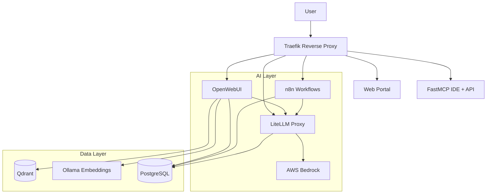

# Project Pluto

**A self-hosted AI development platform with multi-environment deployment support.**

Project Pluto combines best-in-class AI tools into a single, cohesive environment. It unifies chat (OpenWebUI), workflows (n8n), LLM routing (LiteLLM), custom tools (FastMCP), and vector storage (Qdrant)—all backed by PostgreSQL and orchestrated via Traefik reverse proxy.

---

## 🚀 Features

- **🌐 Unified Portal** — Single landing page with navigation to all services
- **💬 OpenWebUI** — Feature-rich chat interface with RAG, document uploads, and multi-model support
- **🔀 LiteLLM Gateway** — OpenAI-compatible API routing to AWS Bedrock (Claude, Llama, etc.)
- **⚡ n8n Workflows** — Visual workflow automation with AI agent capabilities
- **🔧 FastMCP IDE** — VS Code in browser + Python MCP server for custom AI tools
- **📊 Qdrant** — Vector database for persistent document embeddings (RAG)
- **🐘 PostgreSQL** — Shared database with per-service isolation
- **🔐 Self-Signed TLS** — Secure HTTPS for all services via Traefik

---

## 🏗️ Architecture



---

## 🏁 Getting Started

### Prerequisites

1. **Docker Desktop** — Installed and running
2. **AWS CLI** — Configured with Bedrock access
   ```bash
   aws configure  # Enter Access Key, Secret, and Region (e.g., us-east-1)
   ```

### Quick Deploy

```bash
# 1. Clone the repository
git clone <repo-url>
cd project_pluto

# 2. Configure environment
cp .env.example .env
# Edit .env to set passwords and keys (see comments in file)

# 3. Deploy
./pluto.sh deploy docker
```

The deploy script will:
- Generate self-signed TLS certificates
- Update `/etc/hosts` for `*.pluto.local` domains
- Start all containers
- Display access URLs (first OpenWebUI signup becomes admin)

---

## 🔗 Access Points

| Service | URL | Description |
|---------|-----|-------------|
| **Portal** | https://pluto.local | **Start Here!** Navigation hub |
| **OpenWebUI** | https://openwebui.pluto.local | Chat interface & RAG |
| **LiteLLM** | https://litellm.pluto.local | LLM Proxy API & UI |
| **n8n** | https://n8n.pluto.local | Workflow Automation |
| **FastMCP** | https://mcp.pluto.local | VS Code IDE + MCP API |

**Admin Tools** (port 8443):
| Service | URL | Description |
|---------|-----|-------------|
| **pgAdmin** | https://pgadmin.pluto.local:8443 | PostgreSQL UI |
| **Qdrant** | https://qdrant.pluto.local:8443 | Vector DB Dashboard |
| **Traefik** | https://traefik.pluto.local:8443 | Routing Dashboard |

---

## 🛠️ Management

### Backup & Restore

Backup all data (databases, volumes, configurations):
```bash
./pluto.sh backup docker
# Creates: pluto_backup_YYYYMMDD_HHMMSS.tar.gz
```

Restore from backup and deploy:
```bash
./pluto.sh restore docker pluto_backup_20260116_120000.tar.gz
```

### Teardown

```bash
# Stop all containers (data preserved)
./pluto.sh teardown docker

# Stop AND delete all data (fresh start!)
./pluto.sh teardown docker --all
```

---

## 📁 Project Structure

```
project_pluto/
├── pluto.sh              # Universal deployment entrypoint
├── migrate.sh            # Backup/restore utility
├── .env.example          # Environment configuration template
├── docker/               # Local Docker Compose deployment
│   ├── docker-compose.yml
│   ├── deploy.sh
│   ├── teardown.sh
│   ├── fastmcp/          # FastMCP container build
│   └── traefik/          # TLS certs and routing config
├── common/               # Shared configs across environments
│   ├── database/         # PostgreSQL init scripts
│   ├── litellm/          # LiteLLM model configuration
│   └── portal/           # Landing page assets
├── aws/                  # AWS ECS/Fargate deployment
│   ├── deploy.sh
│   ├── teardown.sh
│   └── terraform/        # Infrastructure as code
├── azure/                # Azure deployment (planned)
└── gcp/                  # GCP deployment (planned)
```

---

## ☁️ Multi-Environment Deployment

| Environment | Status | Command |
|-------------|--------|---------|
| **Docker** (Local) | ✅ Ready | `./pluto.sh deploy docker` |
| **AWS** (ECS/Fargate) | 🚧 In Progress | `./pluto.sh deploy aws` |
| **Azure** | 📋 Planned | — |
| **GCP** | 📋 Planned | — |

See `aws/README.md` for AWS deployment architecture details.

---

## 📚 Developed By

**Justin St-Maurice**  
Technical Counselor  
AI Engineering and Systems Design  
Info-Tech Research Group
