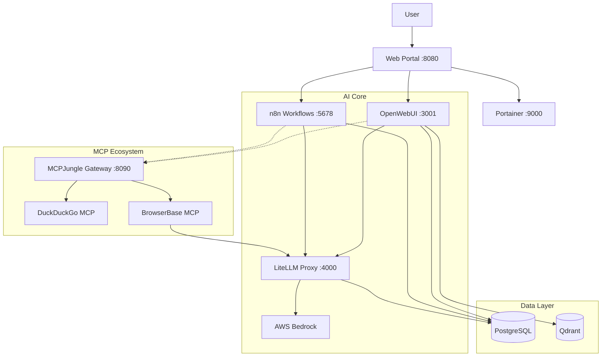

# Project Pluto

**An integrated, containerized AI development platform.**

Project Pluto combines best-in-class AI tools into a single, cohesive local environment. It unifies chat (OpenWebUI), workflows (n8n), LLM routing (LiteLLM), and agentic tools (MCP) under one roof, backed by shared persistence (PostgreSQL/Qdrant).

## 🚀 Features

*   **Unified AI Portal**: A single landing page accessing all services.
*   **LLM Gateway (LiteLLM)**: Access AWS Bedrock models (Claude 3.5, Llama 3.1) via an OpenAI-compatible API.
*   **Agentic Tools (MCP)**:
    *   **MCPJungle**: Central gateway managing all MCP servers.
    *   **BrowserBase**: Cloud browsing automation for agents (powered by local LiteLLM).
    *   **DuckDuckGo**: Privacy-focused web search.
*   **RAG Ready**: Dedicated **Qdrant** container for persistent document embeddings.
*   **Robust Management**:
    *   **Portainer**: Visual Docker management.
    *   **pgAdmin**: PostgreSQL database management.
*   **Production Ready**: Automated scripts for deployment (`deploy.sh`), teardown, and cloud migration (`migrate.sh`).

---

## 🏗️ Architecture



---

## 🏁 Getting Started

### Prerequisites
1.  **Docker Desktop**: Installed and running.
2.  **AWS CLI**: Configured with access to Bedrock models.
    ```bash
    aws configure  # Enter Access Key, Secret, and Region (e.g., us-east-1)
    ```

### Quick Deploy
```bash
# 1. Clone repo
git clone <repo-url>
cd project_pluto

# 2. Configure Environment
cp .env.example .env
# Edit .env to add BrowserBase keys (optional) and customize settings

# 3. Deploy
# 3. Deploy
./pluto.sh deploy docker
```

### Access Points
| Service | URL | Description | Credentials |
|---------|-----|-------------|-------------|
| **Portal** | [https://pluto.local](https://pluto.local) | **Start Here!** Unified navigation. | - |
| **OpenWebUI** | [https://openwebui.pluto.local](https://openwebui.pluto.local) | Chat interface & RAG. | Authentik SSO |
| **LiteLLM** | [https://litellm.pluto.local](https://litellm.pluto.local) | LLM Proxy API & UI. | Master Key in `.env` |
| **n8n** | [https://n8n.pluto.local](https://n8n.pluto.local) | Workflow Automation. | `admin` / `changeme` |
| **MCPJungle** | [https://mcp.pluto.local](https://mcp.pluto.local) | MCP Gateway. | - |
| **Portainer** | [https://portainer.pluto.local](https://portainer.pluto.local) | Docker Management. | Set on first login |
| **pgAdmin** | [https://pgadmin.pluto.local](https://pgadmin.pluto.local) | PostgreSQL UI. | `admin@pluto.com` / `changeme` |
| **Qdrant**| [https://qdrant.pluto.local:8443](https://qdrant.pluto.local:8443) | Vector DB API. | - |
| **Traefik** | [https://traefik.pluto.local](https://traefik.pluto.local) | Routing Dashboard. | - |
| **Authentik** | [https://authentik.pluto.local](https://authentik.pluto.local) | SSO / Identity provider. | Bootstrap from `.env` |

---

## 🛠️ Management & Maintenance

### SSO (Authentik)
Authentik provides SSO at the Traefik gateway. Configure these in `.env` before deploy:
- `AUTHENTIK_BOOTSTRAP_EMAIL`
- `AUTHENTIK_BOOTSTRAP_PASSWORD`
- `AUTHENTIK_SECRET_KEY`
- `AUTHENTIK_OUTPOST_TOKEN` (auto-generated by deploy)

After deployment:
1. Visit `https://authentik.pluto.local` and sign in with the bootstrap credentials.
2. The deploy script will auto-create proxy providers, OIDC clients, and an outpost.
3. Access OpenWebUI, LiteLLM, and n8n via their usual URLs; they will be gated by Authentik.

Note: gateway SSO provides a single login, but each app may still require its own user
configuration unless you also enable OIDC inside the app.

### OIDC (OpenWebUI + LiteLLM)
This enables the apps to treat the Authentik user as the in-app identity.

On fresh deploy, `./pluto.sh deploy docker` automatically:
- Creates OIDC providers in Authentik for OpenWebUI + LiteLLM
- Generates client IDs/secrets and stores them in `.env`
- Wires the apps to Authentik OIDC

Notes:
- LiteLLM’s OSS SSO is limited to 5 users unless you add a license.
- n8n OSS does not support OIDC; it relies on the Authentik forward-auth gate.
  The deploy script disables n8n basic auth when `N8N_BASIC_AUTH_ACTIVE=false`.
- OpenWebUI admin bootstrap is disabled by default. Set `OPENWEBUI_BOOTSTRAP_ADMIN=true`
  and `ADMIN_EMAIL`/`ADMIN_NAME` if you want auto-creation on first deploy.

### Migration (Backup/Restore)
Move your environment between local Docker and cloud deployments.
```bash
# Backup databases + volumes into a portable archive
./migrate.sh backup

# Restore from file
./migrate.sh restore pluto_backup_YYYYMMDD.tar.gz
```

The backup archive includes:
- Postgres logical dumps for `openwebui`, `litellm`, and `n8n`
- Volume data for OpenWebUI, Qdrant, Ollama, and related services

This format is intended to be compatible with future AWS/GCP/Azure restore scripts.

### Teardown
Stop everything. optionally delete data.
```bash
# Stop containers
./pluto.sh teardown docker

# Stop AND delete all data (Fresh Start)
./pluto.sh teardown docker --all
```

---

## 📚 Developed By
Justin St-Maurice
Technical Counselor
AI Engineering and Systems Design
Info-Tech Research Group
