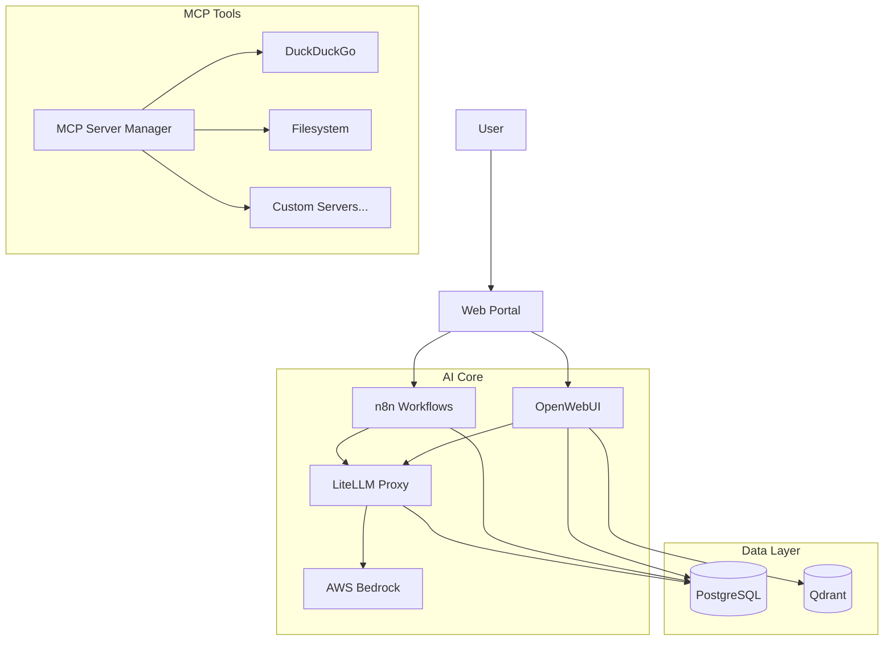

# Project Pluto

**An integrated, containerized AI development platform.**

Project Pluto combines best-in-class AI tools into a single, cohesive local environment. It unifies chat (OpenWebUI), workflows (n8n), LLM routing (LiteLLM), and agentic tools (MCP) under one roof, backed by shared persistence (PostgreSQL/Qdrant).

## 🚀 Features

*   **Unified AI Portal**: A single landing page accessing all services.
*   **LLM Gateway (LiteLLM)**: Access AWS Bedrock models (Claude 3.5, Llama 3.1) via an OpenAI-compatible API.
*   **MCP Server Manager**: Web UI for managing Model Context Protocol servers.
*   **RAG Ready**: Dedicated **Qdrant** container for persistent document embeddings.
*   **Robust Management**:
    *   **pgAdmin**: PostgreSQL database management.
*   **Production Ready**: Automated scripts for deployment, teardown, and cloud migration.

---

## 🏗️ Architecture



---

## 🏁 Getting Started

### Prerequisites
1.  **Docker Desktop**: Installed and running.
2.  **AWS CLI**: Configured with access to Bedrock models.
    ```bash
    aws configure  # Enter Access Key, Secret, and Region (e.g., us-east-1)
    ```

### Quick Deploy
```bash
# 1. Clone repo
git clone <repo-url>
cd project_pluto

# 2. Configure Environment
cp .env.example .env
# Edit .env to customize settings

# 3. Deploy
./pluto.sh deploy docker
```

### Access Points
| Service | URL | Description |
|---------|-----|-------------|
| **Portal** | https://pluto.local | **Start Here!** Unified navigation. |
| **OpenWebUI** | https://openwebui.pluto.local | Chat interface & RAG. |
| **LiteLLM** | https://litellm.pluto.local | LLM Proxy API & UI. |
| **n8n** | https://n8n.pluto.local | Workflow Automation. |
| **MCP Manager** | https://mcp.pluto.local | MCP Server Management UI. |
| **pgAdmin** | https://pgadmin.pluto.local:8443 | PostgreSQL UI. |
| **Qdrant**| https://qdrant.pluto.local:8443 | Vector DB API. |
| **Traefik** | https://traefik.pluto.local:8443 | Routing Dashboard. |

---

## 🛠️ Management & Maintenance

### Migration (Backup/Restore)
Move your environment between local Docker and cloud deployments.
```bash
# Backup
./pluto.sh backup docker

# Restore
./pluto.sh restore docker pluto_backup_YYYYMMDD.tar.gz
```

### Teardown
```bash
# Stop containers
./pluto.sh teardown docker

# Stop AND delete all data (Fresh Start)
./pluto.sh teardown docker --all
```

---

## 📚 Developed By
Justin St-Maurice
Technical Counselor
AI Engineering and Systems Design
Info-Tech Research Group
